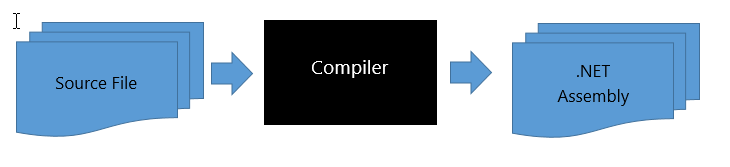

# Roslyn

---
<!--
# So what is Roslyn?
 - open source
- developed by Microsoft
- parse and analyse code
   - C#
   - Visual Basic
- used in Visual Studio
-->

# What is the purpose of Roslyn?

<!-- source: https://github.com/bookercodes/articles/blob/master/csharp-6-an-introduction.md -->

---

<!--
a compiler produces a lot of information during the process of the compilation
they are only internally used while the compiler does it's work
after the compiler is finished all information is thrown away
the problem is that information would be very useful for things like
code analysis
code refactoring
and IntelliSense (IDE Editor)

until now you were able to control a Compiler from outside

Roslyn keeps that information and provides it to other tools over APIs

but what about the 
-->

# Syntax and Semantic APIs
## Syntax Tree
Hight-fidelity representation of source code
## Semantic Model
Answers semantic questions about syntax
## IOperation
Abstracts over common syntactic shapes
for example: unified array[0] and Array<int>.Empty
## Syntax Generator
can generate source code for C# and VB